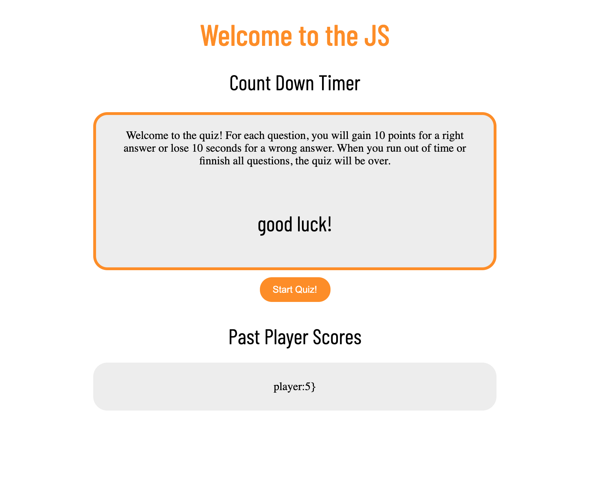

### Live site at [QuizQ](https://cgsdesign.github.io/QuizQ/)
​
For this project I worked primarily in Javasript to create a functional quiz. The given quiz utalizes Javascript to rewrite element of the screen and track scores. Using Local storage, players can keep track of their scores between session.
​
## Key Features
* Clean CSS matching brand orange
* Next questions that display upon prior questions being correctly answered
* Game lock that is reduced by incorrect answers
* Updating High Score list 
* Responsive page design

## Credits
​
* Barlow Condensed font by Jeremy Tribby hosted by Google Fonts.
* ​License text curtasy of https://choosealicense.com/licenses/mit/

​
## Licence 

@@ -41,4 +41,3 @@ THE SOFTWARE IS PROVIDED "AS IS", WITHOUT WARRANTY OF ANY KIND, EXPRESS OR IMPLI
FITNESS FOR A PARTICULAR PURPOSE AND NONINFRINGEMENT. IN NO EVENT SHALL THE
AUTHORS OR COPYRIGHT HOLDERS BE LIABLE FOR ANY CLAIM, DAMAGES OR OTHER
LIABILITY, WHETHER IN AN ACTION OF CONTRACT, TORT OR OTHERWISE, ARISING FROM, OUT OF OR IN CONNECTION WITH THE SOFTWARE OR THE USE OR OTHER DEALINGS IN THE SOFTWARE.